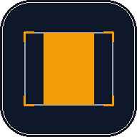

# LED Crop Calc

A lightweight offline PWA that computes centered crop and X/Y offset values for **Novastar V-Can**. Given a layer resolution and a source image resolution, it returns the exact values to enter in V-Can.

**Live app:** [fiverecords.github.io/LedCropCalc](https://fiverecords.github.io/LedCropCalc/)

## What it does

Working with LED walls and V-Can, you often need to display a standard source (like 1920×1080) on a layer with non-standard dimensions (832×1248, 1040×624, etc.). The crop values to keep the image centered and undistorted aren't obvious to calculate on the fly.

This tool does the math for you:

- Enter the **layer (screen)** resolution
- Enter the **source (image)** resolution
- Get the four V-Can crop values: **X, Width, Y, Height**

Tap any value to copy it to the clipboard.

## Install on your phone

The app is a PWA, so you install it directly from the browser — no App Store, no Google Play.

**iPhone (Safari):**
1. Open [the app URL](https://fiverecords.github.io/LedCropCalc/) in Safari
2. Tap the Share button → "Add to Home Screen"

**Android (Chrome):**
1. Open the app URL in Chrome
2. Tap the menu (⋮) → "Install app" or "Add to Home Screen"

Once installed, the app runs offline. Useful for venues with no signal during setup.

## How the calculation works

Given screen `W × H` and source `sW × sH`:

1. If the source is proportionally **wider** than the screen → crop the sides (X axis), keep full height
2. If the source is proportionally **taller** → crop top/bottom (Y axis), keep full width
3. If aspect ratios match → no crop needed

The axis that is **not** cropped is filled with the source's full dimension (V-Can expects explicit values there, not zero).

## Tech

Plain HTML + CSS + vanilla JS. No framework, no build step, no dependencies. ~15 KB total. Service worker caches everything on first load for offline use.

## License

MIT — do whatever you want with it.

## Credits

Built for live event AV/lighting technicians. Not affiliated with Novastar.
